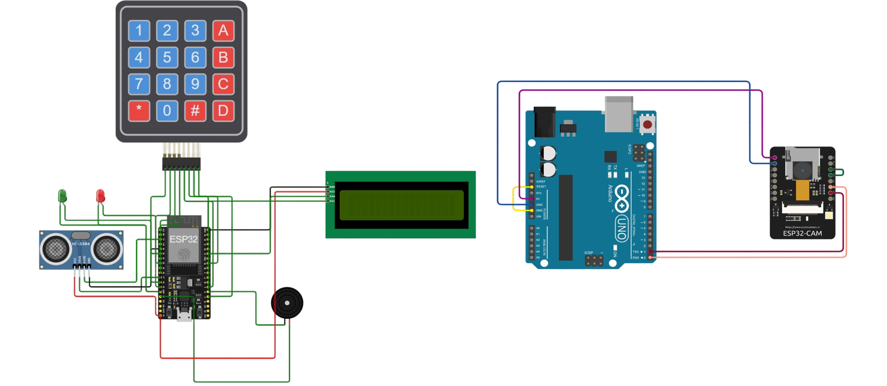

# ESP32-Smart-Surveillance-System
🔒 A smart IoT home security system using ESP32 &amp; ESP32-CAM | Real-time intrusion detection 📸 | Telegram alerts 🚨 | Keypad &amp; remote deactivation | Open-source

## 📌 Project Overview

This system provides:
- Real-time intrusion detection using ultrasonic sensors
- Automatic photo capture and Telegram alerts
- Remote alarm deactivation via Telegram or physical keypad
- Visual and audible alarms (LCD display, buzzer, LED indicators)

### Key Features
✅ Motion detection with HC-SR04 ultrasonic sensor  
✅ Instant Telegram notifications with intruder photos  
✅ Two-factor deactivation (physical keypad + remote Telegram code)  
✅ Visual feedback via 16×2 LCD display  
✅ Audible alarm with buzzer  

## 🛠 Hardware Components
- **ESP32** (Main controller)
- **ESP32-CAM** (Camera module for photo capture)
- **HC-SR04 Ultrasonic Sensor** (Distance measurement)
- **4×4 Matrix Keypad** (Physical security code input)
- **16×2 LCD with I2C** (System status display)
- **Buzzer** (Audible alarm)
- **LEDs** (Visual indicators)
- **Breadboard & jumper wires**

## 📚 Libraries Used
- [Universal Telegram Bot Library](https://github.com/witnessmenow/Universal-Arduino-Telegram-Bot)
- [ArduinoJSON](https://github.com/bblanchon/ArduinoJson)
- [LiquidCrystal_I2C](https://github.com/johnrickman/LiquidCrystal_I2C)
- [Keypad](https://github.com/Chris--A/Keypad)

## 🖥 Software Architecture

### System Components
1. **ESP32-CAM Module** (Camera Node)
   - Handles photo capture
   - Connects to WiFi
   - Sends photos via Telegram bot
   - Runs HTTP server for remote triggering

2. **Main ESP32 Controller** (Alarm Node)
   - Monitors ultrasonic sensor
   - Manages alarm state
   - Handles keypad input
   - Controls LCD display and buzzer
   - Communicates with Telegram bot
  
## 🔌 Wiring Diagram
 
